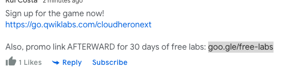
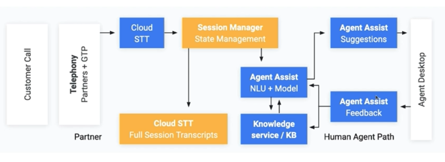

# Hands-on Lab: Automate Interactions with Contact Center AI: Challenge Lab

> _**3:10 PM – 4:30 PM, Rui Costa**_
>
> In this hands-on portion of the workshop, we will guide you through how to get free access to Qwiklabs, our hands-on learning platform, as well as a lab that focus on Google Cloud’s impact on specific industries, “Automate Interactions with Contact Center AI: Challenge Lab”. You’ll have an opportunity to ask live technical deep dive questions here.

## Contact Center AI

Virtual Agent AI, Insights AI, Agent Assist AI – Contact centers

### Core Components

### Architecture – Virtual Agent

Customer Call

Telepathy

Cloud SST \(speech-to-text\)

### Architecture – Agent Assist

### Speech Analysis Framework

A collection of components and code from Google Cloud that you can use to transcribe audio, create a data pipeline workflow to display...

